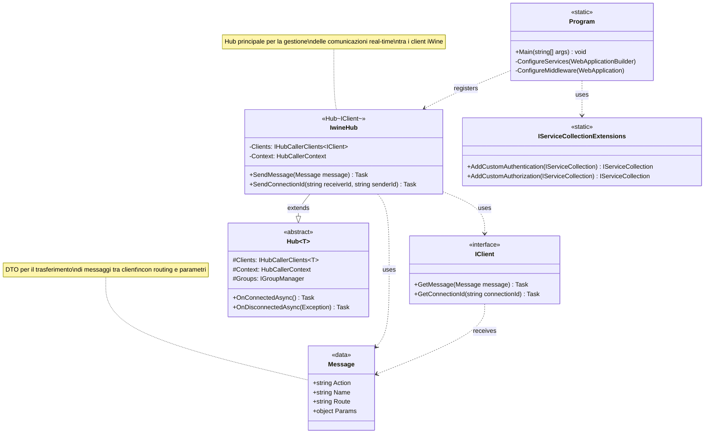

# Diagramma delle Classi - Sistema SignalR iWine

## Descrizione delle Classi

### IwineHub
Il componente centrale del sistema che gestisce tutte le comunicazioni SignalR. Estende `Hub<IClient>` per fornire funzionalità type-safe di comunicazione con i client.

**Responsabilità:**
- Broadcasting di messaggi a tutti i client connessi
- Invio di notifiche point-to-point tra client specifici
- Gestione del ciclo di vita delle connessioni

### IClient
Interfaccia che definisce i metodi che il server può invocare sui client connessi. Implementa il pattern Strongly-Typed Hub.

**Metodi:**
- `GetMessage`: Riceve messaggi broadcast o diretti
- `GetConnectionId`: Riceve l'identificativo di connessione di un altro client

### Message
Data Transfer Object (DTO) che incapsula tutte le informazioni necessarie per il routing e l'elaborazione dei messaggi.

**Proprietà:**
- `Action`: Tipo di azione da eseguire
- `Name`: Nome del messaggio/evento
- `Route`: Percorso di destinazione del messaggio
- `Params`: Parametri dinamici associati al messaggio
