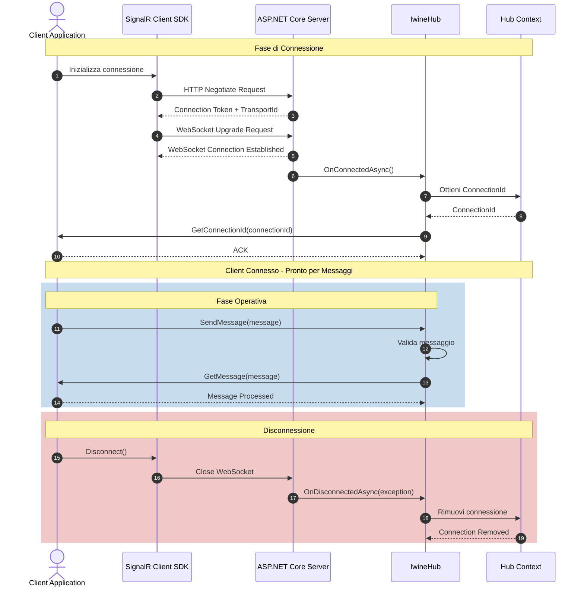

# Diagramma di Sequenza - Connessione Client

## Fasi della Connessione

### 1. Negoziazione (Steps 1-3)
Il client SignalR avvia una richiesta HTTP di negoziazione per ottenere:
- Token di connessione
- Tipo di trasporto disponibile (WebSocket, Server-Sent Events, Long Polling)
- Endpoint del server

### 2. Upgrade WebSocket (Steps 4-5)
Se supportato, il client richiede l'upgrade della connessione HTTP a WebSocket per comunicazione bidirezionale full-duplex.

### 3. Registrazione Hub (Steps 6-9)
Il metodo `OnConnectedAsync()` viene invocato automaticamente:
- Genera un ConnectionId univoco per il client
- Invia il ConnectionId al client tramite `GetConnectionId()`
- Il client può usare questo ID per comunicazioni dirette

### 4. Fase Operativa (Steps 10-13)
Il client può ora:
- Inviare messaggi tramite `SendMessage()`
- Ricevere messaggi tramite `GetMessage()`
- Mantenere la connessione persistente

### 5. Disconnessione (Steps 14-17)
Quando il client si disconnette:
- `OnDisconnectedAsync()` viene invocato
- Le risorse vengono rilasciate
- Il ConnectionId viene rimosso dal contesto
