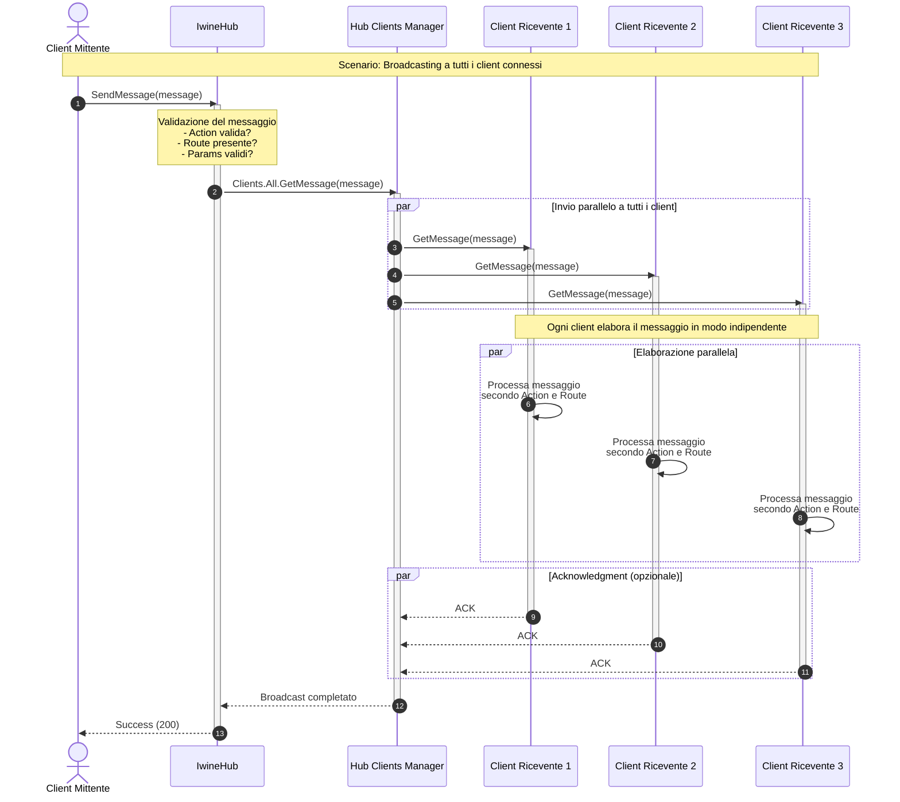

# Diagramma di Sequenza - Broadcasting Messaggi



## Meccanismo di Broadcasting

### Caratteristiche del Broadcasting
1. **Fire-and-Forget**: Il mittente non attende conferma dai riceventi
2. **Invio Parallelo**: Tutti i client ricevono il messaggio simultaneamente
3. **Indipendenza**: Ogni client elabora il messaggio autonomamente

### Struttura del Messaggio
```json
{
  "Action": "notifica",
  "Name": "nuovo_ordine",
  "Route": "/ordini/123",
  "Params": {
    "orderId": 123,
    "status": "pending",
    "timestamp": "2025-11-03T10:30:00Z"
  }
}
```

### Casi d'Uso
- **Notifiche di sistema**: Aggiornamenti broadcast a tutti gli utenti
- **Eventi globali**: Cambio stato applicazione, manutenzione programmata
- **Sincronizzazione dati**: Aggiornamenti cache condivisa
- **Broadcasting eventi**: Nuovi ordini, messaggi pubblici, alert
