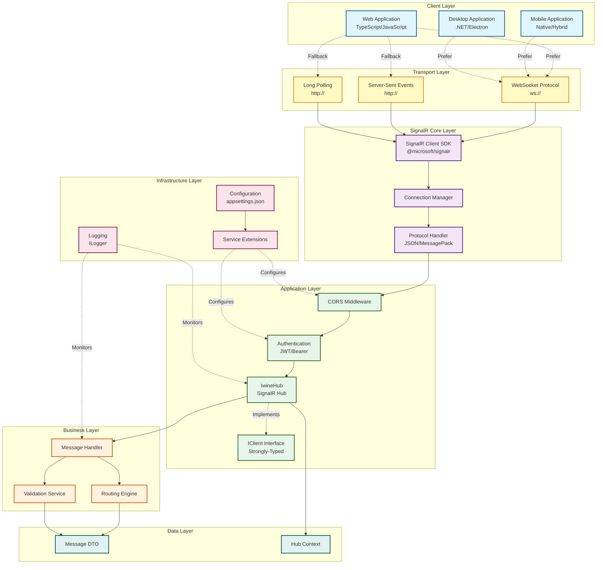

# Diagramma dei Componenti - Architettura Sistema

## Descrizione dei Livelli

### 1. Client Layer
Applicazioni client che utilizzano il sistema SignalR:
- **Web Application**: Client browser-based con TypeScript/JavaScript
- **Mobile Application**: App native o hybrid (React Native, Flutter, Xamarin)
- **Desktop Application**: Applicazioni desktop .NET o Electron

### 2. Transport Layer
Protocolli di trasporto supportati da SignalR con fallback automatico:
- **WebSocket**: Protocollo preferito per comunicazione bidirezionale full-duplex
- **Server-Sent Events**: Fallback per browser che non supportano WebSocket
- **Long Polling**: Fallback finale per massima compatibilità

### 3. SignalR Core Layer
Componenti core del framework SignalR:
- **Client SDK**: Libreria `@microsoft/signalr` per gestione connessioni
- **Connection Manager**: Gestione del ciclo di vita delle connessioni
- **Protocol Handler**: Serializzazione/deserializzazione messaggi (JSON/MessagePack)

### 4. Application Layer
Logica applicativa del server:
- **CORS Middleware**: Gestione Cross-Origin Resource Sharing
- **Authentication**: Validazione JWT token e autenticazione utenti
- **IwineHub**: Hub principale per routing messaggi
- **IClient Interface**: Contratto strongly-typed per comunicazione server-to-client

### 5. Business Layer
Logica di business per elaborazione messaggi:
- **Message Handler**: Gestione del ciclo di vita dei messaggi
- **Routing Engine**: Instradamento messaggi basato su Action/Route
- **Validation Service**: Validazione struttura e contenuto messaggi

### 6. Infrastructure Layer
Servizi di supporto e configurazione:
- **Configuration**: Gestione impostazioni da appsettings.json
- **Service Extensions**: Extension methods per configurazione servizi
- **Logging**: Sistema di logging centralizzato

### 7. Data Layer
Modelli dati e contesto:
- **Message DTO**: Data Transfer Object per messaggi
- **Hub Context**: Contesto runtime dell'hub con informazioni connessioni

## Flusso dei Dati

1. **Client → Server**: Client invia messaggio tramite SDK
2. **Transport**: Messaggio trasmesso via WebSocket (o fallback)
3. **Protocol**: Deserializzazione da JSON a oggetto Message
4. **Security**: Validazione CORS e autenticazione
5. **Hub**: Routing al metodo appropriato di IwineHub
6. **Business**: Elaborazione e validazione del messaggio
7. **Distribution**: Invio ai client destinatari tramite IClient interface
