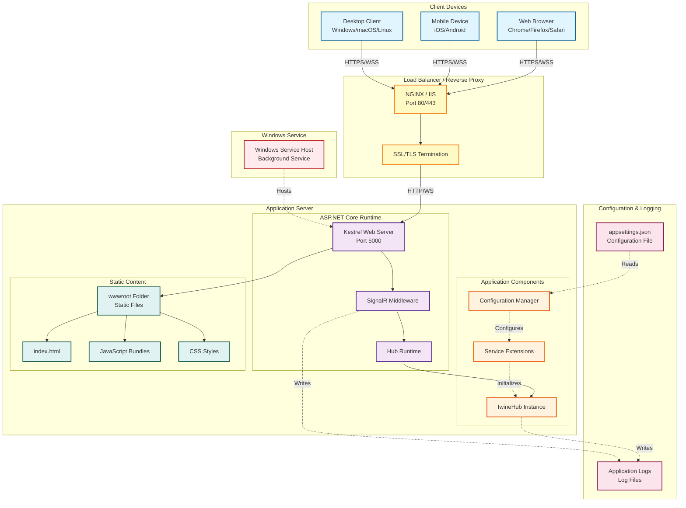

# Diagramma di Deployment



## Architettura di Deployment

### 1. Livello Client
**Dispositivi Supportati:**
- Browser web moderni (Chrome, Firefox, Safari, Edge)
- Applicazioni mobile native (iOS/Android)
- Client desktop multi-piattaforma

**Protocolli:**
- HTTPS per chiamate HTTP
- WSS (WebSocket Secure) per comunicazione real-time

### 2. Load Balancer / Reverse Proxy
**Componenti:**
- **NGINX o IIS**: Reverse proxy per gestione traffico
- **SSL/TLS Termination**: Decrittazione HTTPS/WSS

**Funzionalità:**
- Terminazione SSL/TLS
- Bilanciamento del carico tra più istanze server
- Compressione response
- Caching statico
- Rate limiting

**Configurazione NGINX Esempio:**
```nginx
upstream signalr_backend {
    ip_hash;  # Importante per sticky sessions con SignalR
    server localhost:5000;
}

server {
    listen 443 ssl;
    server_name iwine.example.com;
    
    ssl_certificate /path/to/cert.pem;
    ssl_certificate_key /path/to/key.pem;
    
    location /hub {
        proxy_pass http://signalr_backend;
        proxy_http_version 1.1;
        proxy_set_header Upgrade $http_upgrade;
        proxy_set_header Connection "upgrade";
        proxy_set_header Host $host;
        proxy_cache_bypass $http_upgrade;
    }
}
```

### 3. Application Server
**Runtime Environment:**
- ASP.NET Core 8.0
- Kestrel Web Server
- Windows Service Host (per deployment come servizio)

**Componenti:**
- **Kestrel**: Server web cross-platform ad alte prestazioni
- **SignalR Middleware**: Pipeline per gestione connessioni SignalR
- **Hub Runtime**: Ambiente di esecuzione per IwineHub
- **Static Files**: Servizio di file statici da wwwroot

### 4. Configuration Management
**File di Configurazione:**
```json
{
  "PathBase": "/",
  "Logging": {
    "LogLevel": {
      "Default": "Information",
      "Microsoft.AspNetCore.SignalR": "Debug"
    }
  },
  "AllowedHosts": "*"
}
```

**Gestione Environment:**
- `appsettings.json`: Configurazione base
- `appsettings.Development.json`: Override per sviluppo
- `appsettings.Production.json`: Override per produzione

### 5. Windows Service Deployment
**Configurazione come Servizio:**
```powershell
# Pubblicazione applicazione
dotnet publish -c Release -r win-x64

# Installazione come servizio Windows
sc create IwineSignalRService binPath="C:\path\to\iwine-signalr.exe"
sc start IwineSignalRService
```

**Vantaggi:**
- Avvio automatico all'avvio di Windows
- Gestione tramite Services Manager
- Logging integrato con Event Viewer

## Opzioni di Deployment

### Opzione 1: Windows Server + IIS
- Hosting in IIS con modulo ASP.NET Core
- Gestione pool applicazioni
- Integrazione con Windows Authentication

### Opzione 2: Windows Service
- Esecuzione come servizio background
- Avvio automatico
- Gestione tramite sc.exe o PowerShell

### Opzione 3: Docker Container
```dockerfile
FROM mcr.microsoft.com/dotnet/aspnet:8.0
WORKDIR /app
COPY bin/Release/net8.0/publish/ .
EXPOSE 5000
ENTRYPOINT ["dotnet", "iwine-signalr.dll"]
```

### Opzione 4: Azure App Service
- Deployment cloud managed
- Scaling automatico
- Integrazione con Azure SignalR Service per scale-out

## Considerazioni per Scalabilità

### Scale-Out con Backplane
Per deployment multi-server, implementare un backplane:

**Opzioni:**
- **Redis**: `services.AddSignalR().AddStackExchangeRedis(connection)`
- **Azure SignalR Service**: Servizio managed per scale-out automatico
- **SQL Server**: Backplane basato su database

### Sticky Sessions
Configurare sticky sessions nel load balancer:
- Basato su IP client (`ip_hash` in NGINX)
- Basato su cookie di sessione
- Necessario se non si usa un backplane
