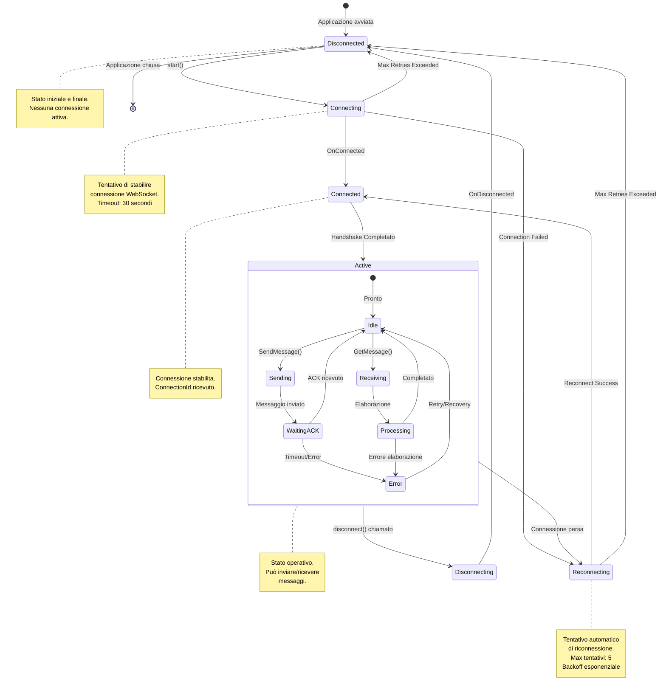

# Diagramma di Stato - Ciclo di Vita Connessione Client



## Stati della Connessione

### 1. Disconnected
**Descrizione:** Stato iniziale prima della connessione o dopo disconnessione completa.

**Caratteristiche:**
- Nessuna connessione attiva
- ConnectionId non disponibile
- Client non può inviare/ricevere messaggi

**Transizioni:**
- → `Connecting`: Quando viene chiamato `connection.start()`
- → `[*]`: Quando l'applicazione viene chiusa

### 2. Connecting
**Descrizione:** Tentativo di stabilire connessione con il server.

**Processo:**
1. Negoziazione HTTP per ottenere connection token
2. Tentativo di upgrade a WebSocket
3. Handshake SignalR protocol

**Timeout:** 30 secondi (configurabile)

**Transizioni:**
- → `Connected`: Connessione stabilita con successo
- → `Reconnecting`: Primo tentativo fallito
- → `Disconnected`: Tutti i tentativi esauriti

### 3. Connected
**Descrizione:** Connessione stabilita con successo.

**Caratteristiche:**
- WebSocket attivo
- ConnectionId assegnato dal server
- Pronto per transizione a stato Active

**Azioni:**
- Ricezione ConnectionId via `GetConnectionId()`
- Inizializzazione handler messaggi
- Registrazione callback

**Transizioni:**
- → `Active`: Handshake completato, pronto per operazioni

### 4. Active
**Descrizione:** Stato operativo principale con sotto-stati.

#### 4.1 Idle (Sub-state)
- Client in attesa di eventi
- Può inviare o ricevere messaggi
- Connessione keep-alive attiva

#### 4.2 Sending (Sub-state)
- Invio messaggio in corso
- Serializzazione e trasmissione
- Attesa conferma server

#### 4.3 WaitingACK (Sub-state)
- Attesa acknowledgment dal server
- Timeout: 5 secondi
- Se timeout → Error state

#### 4.4 Receiving (Sub-state)
- Ricezione messaggio dal server
- Deserializzazione in corso

#### 4.5 Processing (Sub-state)
- Elaborazione business logic del messaggio
- Aggiornamento UI/stato applicazione
- Possibile errore se messaggio malformato

#### 4.6 Error (Sub-state)
- Gestione errori temporanei
- Retry logic
- Logging errore

**Transizioni Active:**
- → `Reconnecting`: Perdita improvvisa connessione (network issue)
- → `Disconnecting`: Chiamata esplicita a `disconnect()`

### 5. Reconnecting
**Descrizione:** Tentativo automatico di ristabilire connessione.

**Strategia di Reconnect:**
```typescript
const reconnectPolicy = {
    nextRetryDelayInMilliseconds: (retryContext) => {
        // Backoff esponenziale
        if (retryContext.previousRetryCount === 0) {
            return 0;
        }
        // 2, 10, 30 secondi, etc.
        return Math.min(1000 * Math.pow(2, retryContext.previousRetryCount), 30000);
    }
};
```

**Parametri:**
- Max tentativi: 5 (configurabile)
- Backoff esponenziale: 2s, 4s, 8s, 16s, 30s
- Jitter randomico per evitare thundering herd

**Transizioni:**
- → `Connected`: Riconnessione riuscita
- → `Disconnected`: Max tentativi superati

### 6. Disconnecting
**Descrizione:** Chiusura controllata della connessione.

**Processo:**
1. Invio messaggio di chiusura al server
2. Attesa conferma dal server
3. Chiusura WebSocket
4. Cleanup risorse client-side

**Cleanup:**
- Rimozione event handlers
- Cancellazione timer keep-alive
- Clear ConnectionId

**Transizioni:**
- → `Disconnected`: Disconnessione completata

## Eventi e Callback

### Codice Esempio TypeScript
```typescript
const connection = new signalR.HubConnectionBuilder()
    .withUrl("/hub")
    .withAutomaticReconnect()
    .build();

// Monitoring degli stati
connection.onclose((error) => {
    console.log("Stato: Disconnected", error);
});

connection.onreconnecting((error) => {
    console.log("Stato: Reconnecting", error);
});

connection.onreconnected((connectionId) => {
    console.log("Stato: Connected", connectionId);
});

// Avvio connessione
await connection.start(); // Disconnected → Connecting → Connected
```

## Metriche e Monitoring

### KPI da Monitorare
- **Connection Success Rate**: % connessioni riuscite al primo tentativo
- **Average Reconnection Time**: Tempo medio per riconnessione
- **Message Delivery Rate**: % messaggi consegnati con successo
- **Active Connections**: Numero connessioni attive simultanee
- **Average Connection Duration**: Durata media sessioni client
